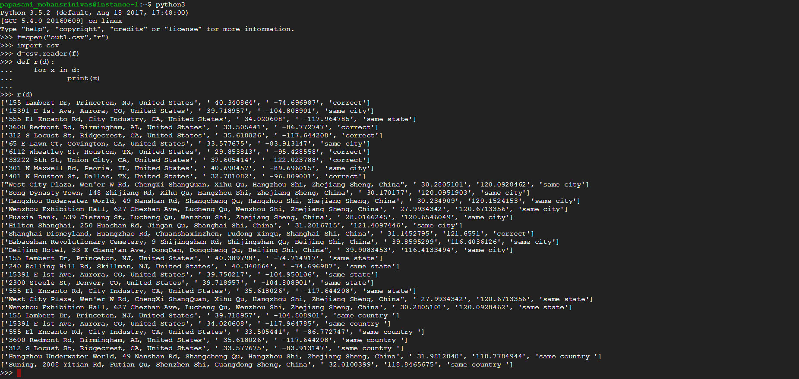

Please rename this doc to "README.md" and provide it with your submission.

If you need to use imagery, create a `docs` folder, put your screenshots or images in there, and link them like this:

for running the file 

sample output from out.csv

you can open the outputfile in cmd and can check result like this

--- END NOTES ---

# Geofencing Validator 

# User Guide

If you have pip3 installed in linux 
then use "sudo pip3 install geocoder"

else if ypu don't have even pip 
then install pip3 with 
"sudo apt-get install python3-setuptools"
then  "sudo easy_install3 pip"
then again try "sudo pip3 install geocoder"

# Project Description

  Checks whether address is appropriate for given lat,long

## Prerequisites
1. Python 3
  1. geocoder module is must
2.Mapbox apikey for their geocoding services.
  2. api_key for map_box_api = 
  api_key_1 = "pk.eyJ1IjoibW9oYW4wMCIsImEiOiJjajg0bDdudDYwOHM1MndwZmNjenp1dTduIn0.LxknjhXAQ_1n98amoXAANw"

  api_key_2 = "pk.eyJ1IjoibW9oYW4wMCIsImEiOiJjajgzZDZ6bGo3ZHdzMzNycjdlcnZqeHY4In0.caVuIsMV5qClz4zHIKvFIg"

## Local Testing

To run tests from terminal in ubuntu 

use cmd:- python3 geocodingValidator_.py location-for-dev.csv output_filename.csv

## Running Tests
Tests are run with given location-for-dev.csv file 

outputfile is named as out.csv

## Notes
I ran tests on rented instance of ubuntu 16.04 on google cloud platform 

screen shots are taken while running the code from terminal.

JSON format returned by MAPBOX services contains usually country,county,state,city,lat,long information contained as key,values

U could acces them as variable.json['country'],variable.json['county'] etc..

map_box.py file may show  error statements  if map_box_api returns null values for given lat,long or addresses

