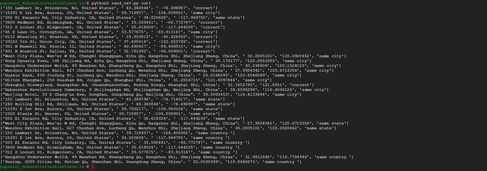

Please rename this doc to "README.md" and provide it with your submission.

If you need to use imagery, create a `docs` folder, put your screenshots or images in there, and link them like this:




--- END NOTES ---

# Geofencing Validator 
Deployment Guide

### Checks whether address is appropriate for given lat,long

## Prerequisites
1. Python 3
  1. geocoder module


## Local Deployment

Py -3 geocodingValidator_.py location-for-dev.csv output_filename.csv


## Production Build and Installation
How to build the application for upload to a server
```bash
Note: assume it is a dedicated server not AWS or Heroku.
```

### Manual Deployment Notes

## Running Tests

## Notes